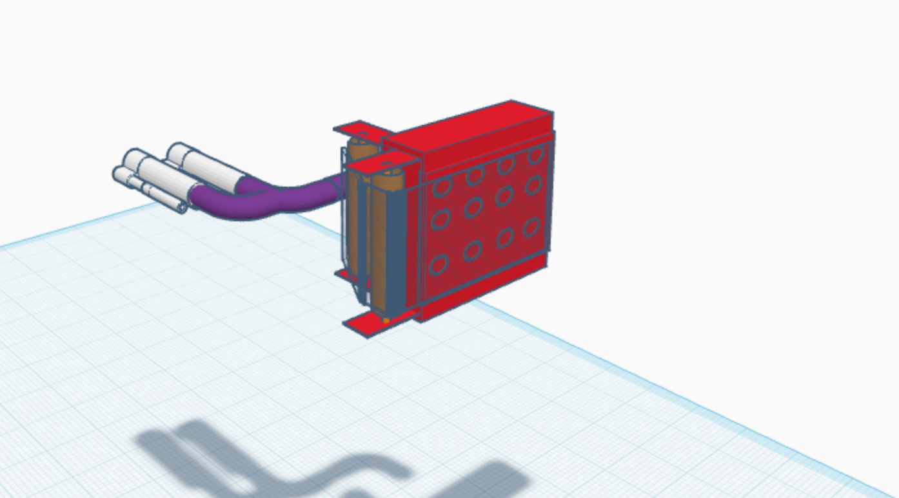
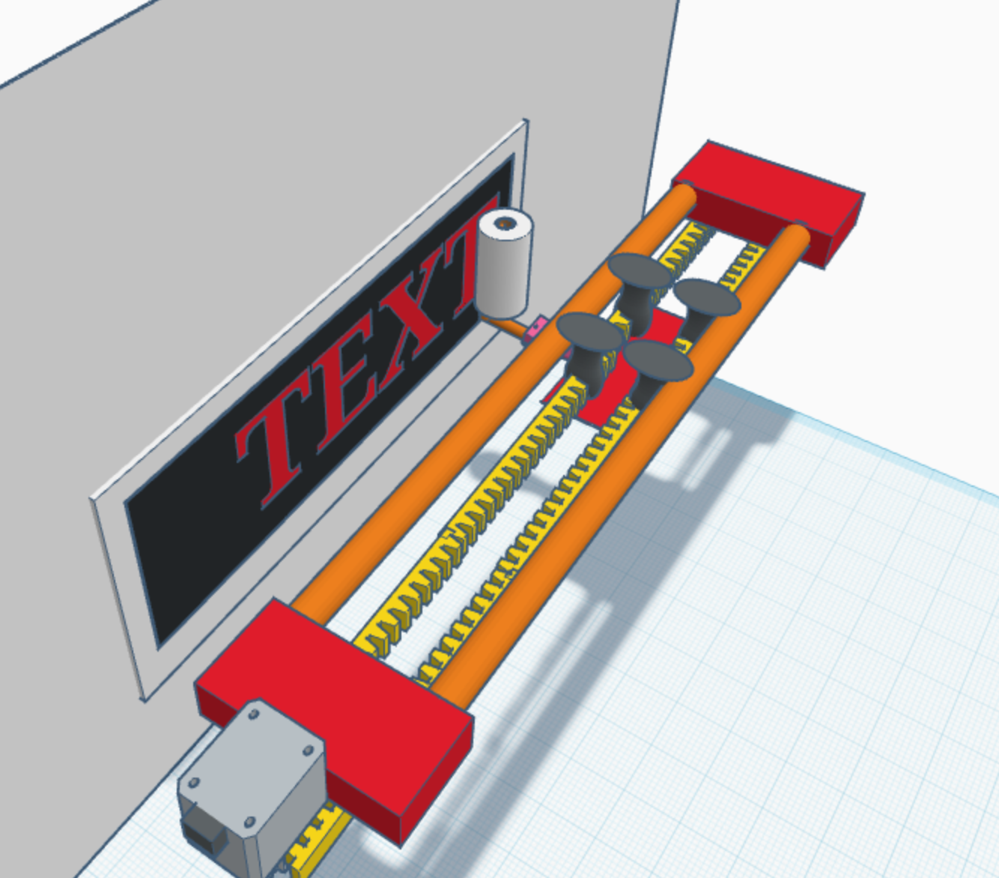
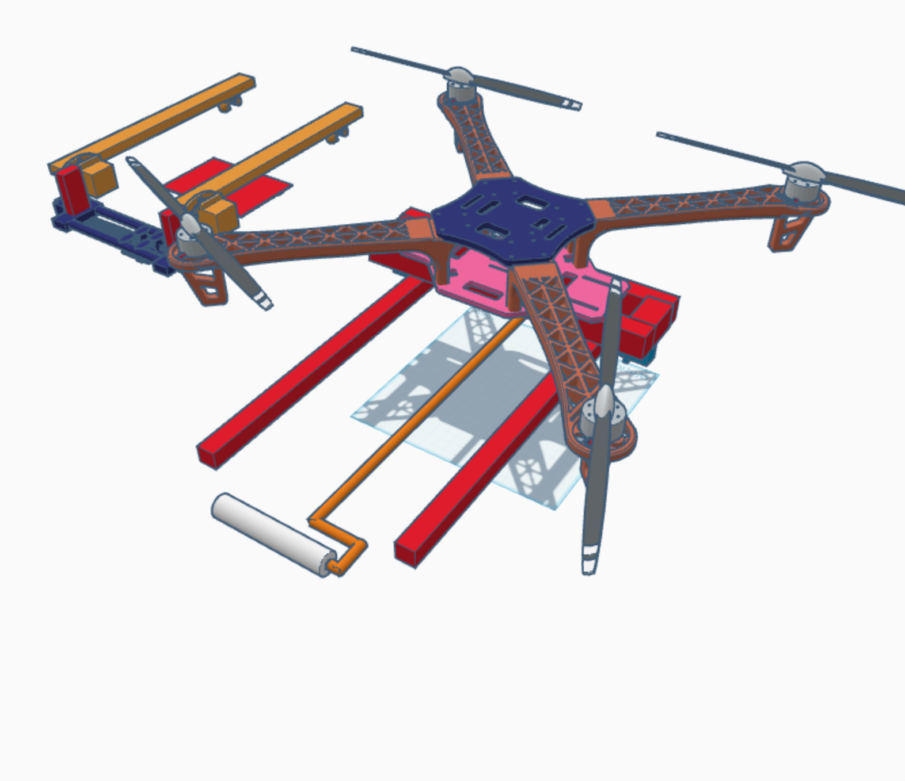

# drone-with-arms-banner-pasting# 🚁 Drone with Robotic Arms for Banner Pasting – Proof of Concept

## 🎯 Project Vision

To create an innovative drone system equipped with a robotic hand and a paint roller for **precise and efficient banner deployment**, revolutionizing advertising and public messaging by enabling autonomous banner installation on high-rise surfaces with **minimal human intervention**.

---

## 🧩 Problem Statement

Placing hoardings or banners on tall walls or buildings is:
- Labor-intensive and risky
- Requires scaffolding or cranes
- Slow and costly for repeated campaigns

> Existing drones with robotic arms exist for generic payload tasks, but there are **no scalable solutions** for **automated vertical surface applications** like banner placement.

---

## 🚀 What I Built

This is a **proof-of-concept (PoC)** for a drone system that can:
- Fly toward vertical surfaces (e.g. buildings, billboards)
- Deploy a banner using static or servo-controlled arms
- Apply pressure using a lightweight roller or mount to ensure adhesion

---

## ⚙️ Hardware Stack

| Component | Description |
|----------|-------------|
| **Flight Controller** | Pixhawk 2.3.1 |
| **Frame** | Generic 450mm quadcopter |
| **Motors** | 2200KV brushless motors |
| **ESCs** | 30A ESCs |
| **Battery** | 3S 2200mAh LiPo |
| **Arms (PoC)** | Basic 3D-printed or fixed mount |
| **Adhesion** | Conceptual double-sided tape or roller mechanism |

---

## 🧪 Prototyping Journey

1. **Ideation** – Banner deployment drone as an automation solution  
2. **Prototype Build** – Pixhawk-based quadcopter with static arm mounts  
3. **Concept Video** – Explained the idea + system layout  
4. **Next Phase (if scaled)** – Servo-actuated arms, pressure sensors, wall-following SLAM

---

## 🧠 Learnings

- Drone stability is highly affected by arm extension and payload placement
- Arm actuation must be synchronized with flight behavior
- Vertical proximity control (distance to wall) is critical
- Need to reduce total system weight while preserving functionality

---

## 📸 Media

- 📷 Photos of quadcopter build, Pixhawk integration, arm design
- 🎥 [Concept explanation video](https://drive.google.com/file/d/1pDI1t1Oe-g_tr-Z-ph_X35ysEsER921c/view?usp=sharing)
- 🖼️ 

---

## 🧱 3D Design Iterations

These models were created in TinkerCAD to explore arm placement, component fitting, and banner pressing mechanisms.

### Iteration 1 – Vacuum Paste mechanism

### Iteration 2 – Camera Slider inspired concept

### Iteration 3 – Basic Arm Mount

## 🔜 Future Scope

If extended beyond PoC:
- Add computer vision to detect wall and banner alignment
- Use servo-controlled arms with pressure feedback
- Develop a modular banner mounting system
- Integrate with ROS for SLAM + offboard control

---

## 📂 Folder Structure

